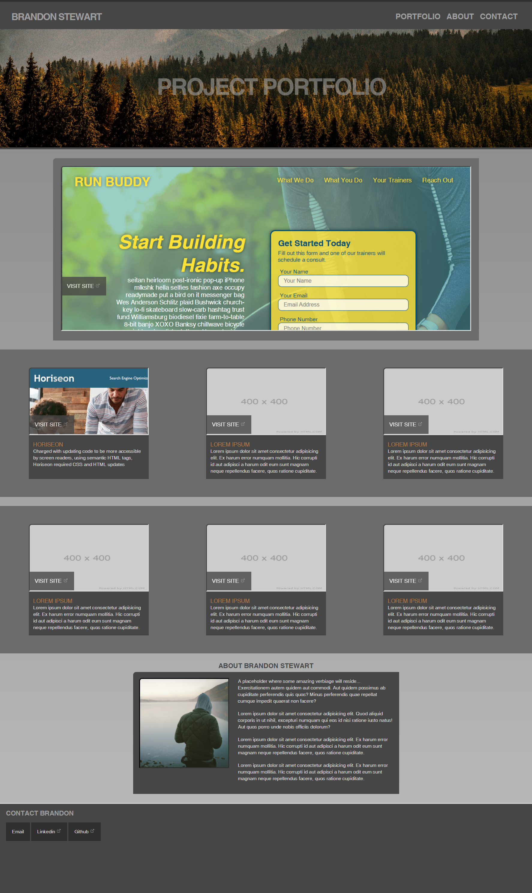

# portfolio
A portfolio of my recent work.

# Brandon Stewart
> Site example using semantic code with accessible markup.
> Live site demo: [_Brandon Stewart's Portfolio_](https://brandon-stewart-rgb.github.io/portfolio/). 

## General Information

A site developed for the purpose of showcasing my online projects with the idea to place more content at a future date.

### Technologies Used

        * HTML
        * CSS
        * Gitbash
        * Github
        * Gitpages
        * GoFullPage
        * Visual Studio Code 

        

#### Screenshot
 

